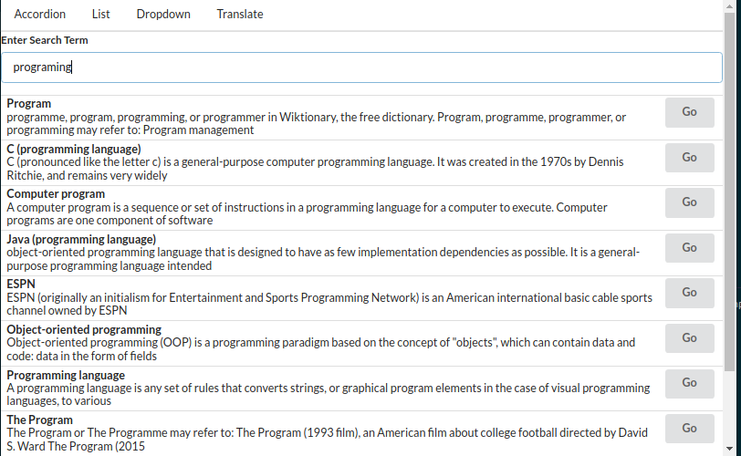

# Getting Started with React wikipedia search widget and Google translate widget
by Alexander binder

This project was bootstrapped with [Create React App](https://github.com/facebook/create-react-app).

by using the Google Translate and Wikipedia API 

## Available Scripts

In the project directory, you can run:

### `npm start`

Runs the app in the development mode.\
Open [http://localhost:3000](http://localhost:3000) to view it in your browser.

